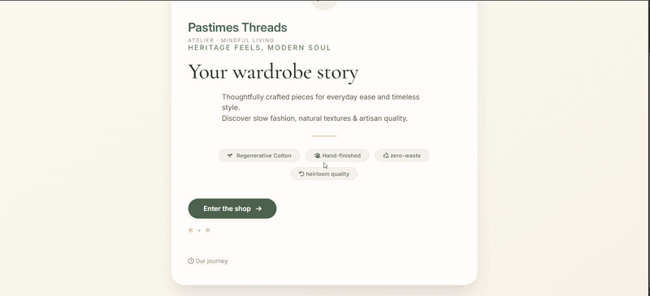

# Pastimes Threads — Clothing Marketplace

**Pastimes Threads** is a PHP 8 / MySQL e-commerce web application built for the **WEDE6021 POE** assessment.

---

## About the Application

**Type of eShop:** A second-hand and artisan clothing marketplace where buyers can browse and purchase garments, and sellers can list their own items for sale.

**Goals:**

- Provide a platform for discovering slow-fashion, pre-loved, and handcrafted clothing.
- Enable sellers to list and manage their own garments with photos and descriptions.
- Give buyers a smooth shopping-cart and checkout experience with order history.
- Provide administrators with full oversight of users, products, sellers, and orders.

---

## Demo



## Full Walkthrough

[▶️ Watch Video](https://youtu.be/kap92cGKQzQ)

## Tech Stack

| Layer | Technology |
| --- | --- |
| Back-end | PHP 8.2 (procedural) |
| Database | MySQL / MariaDB 10.4 |
| Front-end | HTML5, CSS3, vanilla JavaScript |
| Icons | Font Awesome 6 |
| Server | Apache (XAMPP recommended) |

> No external PHP packages or Composer dependencies — the project runs on a plain XAMPP stack.

---

## Setup Instructions

### Requirements

- XAMPP (Apache + PHP 8+ + MySQL)
- A modern web browser

### Steps

1. Copy the project folder into your web root:

   ```text
   C:\xampp\htdocs\Pastimes\
   ```

2. Open **phpMyAdmin**, create a database named `clothingstore`, then import `clothingstore.sql` (project root) to create all tables and seed sample data.

3. Confirm connection settings in `config/DBConn.php`:

   ```text
   host: 127.0.0.1 | db: clothingstore | user: root | pass: (blank)
   ```

4. Start Apache and MySQL in the XAMPP Control Panel, then open:

   ```text
   http://localhost/Pastimes/
   ```

> Tables for reviews (`tblreview`) and messages (`tblmessage`) are created automatically at runtime if they do not exist — no manual SQL is needed for these.

---

## Test Accounts

### Administrator

| Name | Username | Password | Access |
| --- | --- | --- | --- |
| Thabo Nkosi | `thabo_admin` | `admin123` |— cannot shop |
| admin123 | `admin123` | `admin123` | Full admin panel — cannot shop |

The admin manages the entire platform: activates seller accounts, edits and removes products, monitors all orders, and responds to customer and seller messages.

> **Note:** The admin logs in at `login.php` using the `tbladmin` table — a separate credential store from regular users.

---

### Sellers (approved — products visible in shop)

Sellers log in through the same `login.php` as customers. After logging in they can navigate to **Seller Hub** to manage listings and update order statuses. All three accounts below are pre-approved so their products appear in the shop immediately after import.

| Name | Username | Password | Brand | Specialty |
| --- | --- | --- | --- | --- |
| Amahle Dube | `amahle_threads` | `amahle123` | Amahle Threads | Vintage streetwear and denim |
| Sipho Cele | `sipho_style` | `sipho123` | Sipho Style | Smart-casual and formal menswear |
| Priya Naidoo | `priya_boutique` | `priya123` | Priya Boutique | Handcrafted accessories and knitwear |

**Products per seller after import:**

| Seller | Products listed |
| --- | --- |
| Amahle Threads | Linen Blend Shirt, Vintage Denim Jacket |
| Sipho Style | Organic Cotton Tee, French Terry Joggers, Full-Grain Belt |
| Priya Boutique | Handwoven Scarf, Linen Midi Dress |

> Products from unapproved sellers do **not** appear in the shop. Sellers who register after import start with `approval_status = 'pending'` and must be activated by the admin before their listings go live.

---

### Customers (buyers)

| Name | Username | Password | Notes |
| --- | --- | --- | --- |
| John Mokoena | `john123` | `123456` | Active — use for placing and cancelling orders |
| Jane Botha | `jane123` | `123456` | Active |
| Mike Peters | `mike123` | `123456` | Active |
| Sara Nxumalo | `sara123` | `123456` | Active |
| Lebo Khumalo | `lebo123` | `123456` | Active |
| Zanele Moyo | `zanele123` | `123456` | Active |
| Unathi Buyer | `unathi_buys` | `unathi123` | Active — recommended for POE demonstration |

> New registrations are automatically activated — users can log in immediately after signing up.

---

## Key Features by Role

### Admin

- Full CRUD over users, products, and categories
- Approve / reject seller applications
- Monitor all orders across the platform
- Messaging dashboard: view and reply to messages from both customers and sellers (sellers shown with a **Seller** badge and brand name)

### Seller

- Register a seller brand (pending admin approval)
- List, edit, and delete own product listings with image upload
- View orders containing their products with per-product quantity breakdown
- Advance order status: **Pending → Shipped → Delivered**
- Track total revenue from own listings
- View all **customer reviews and ratings** left on their products
- **Message admin** directly from Seller Hub — replies appear in the same thread

### Customer

- Browse the shop, filter by category
- Add to cart (AJAX, persisted in database), update quantities, remove items
- Checkout with delivery address; order confirmed with session ID
- View full order history with grand total of all purchases
- **Cancel** a pending order (stock automatically restored)
- Leave a **star rating and review** on any delivered product (one review per product)
- Contact admin support via the Messages page

---

## Application Structure

```text
Pastimes/
├── index.php                   # Landing page
├── clothingstore.sql           # Database schema + seed data
├── README.md                   # This file
├── config/
│   └── DBConn.php              # Database connection
├── data/
│   └── userData.txt            # Sample user records
├── pages/
│   ├── login.php               # Login (customers, sellers, admin)
│   ├── register.php            # Customer registration (auto-activated)
│   ├── shop.php                # Product grid with cart integration
│   ├── product.php             # Single product detail + review form
│   ├── checkout.php            # Shopping cart view
│   ├── process_checkout.php    # Order creation and confirmation
│   ├── cart_add.php            # AJAX: add item (increases qty if duplicate)
│   ├── cart_remove.php         # AJAX: remove item
│   ├── cart_update.php         # AJAX: update quantity
│   ├── my_orders.php           # Order history + grand total
│   ├── sellers_hub.php         # Seller dashboard (products, orders, messages, reviews)
│   ├── seller_register.php     # Seller brand application form
│   ├── admin.php               # Admin: users + products CRUD
│   ├── admin_orders.php        # Admin: order management
│   ├── messages.php            # Customer inbox (buyer ↔ admin)
│   ├── admin_messages.php      # Admin messaging dashboard (customers + sellers)
│   └── logout.php              # Session destroy → login
└── uploads/                    # Product image uploads
```

---

## Core Functions

| Function | File | Behaviour |
| --- | --- | --- |
| **Login** | `login.php` | Authenticates user against `tblUser` then `tbladmin` |
| **ProcessInput** | `login.php`, `register.php` | Validates and sanitises all form fields |
| **AddItem** | `cart_add.php` | AJAX; ON DUPLICATE KEY UPDATE increases qty |
| **RemoveItem** | `cart_remove.php` | AJAX; removes one product line from cart |
| **Checkout** | `process_checkout.php` | Creates order, writes `tblorderline`, decrements stock |
| **EmptyCart** | `process_checkout.php` | Deletes all cart rows for user after successful order |

Cart is persisted in `tblcart` (database), so items survive page navigation and browser back.

---

## Checkout & Orders

After a successful checkout the confirmation page shows:

- **Order Number** — formatted as `ORD-00000001`
- **Session ID** — the PHP `session_id()` for reference
- Links to **My Orders** and **Return to Shop**

**My Orders** lists every past order with date, status badge, expandable item breakdown, and a **grand total** across all purchases at the bottom.

---

## Database Tables

| Table | Purpose |
| --- | --- |
| `tblUser` | Registered customers and sellers (`status`: active) |
| `tbladmin` | Admin credentials (separate from tblUser) |
| `tblclothes` | Product catalogue (name, price, stock, image, seller) |
| `tblseller` | Seller profiles and approval status |
| `tblcart` | Active cart items per user |
| `tblorder` | Order headers (total, address, status: pending / shipped / delivered / cancelled) |
| `tblorderline` | Order line items (product, quantity, unit price) |
| `tblreview` | Customer product reviews (rating 1–5, comment; one per user per product) |
| `tblmessage` | User ↔ admin messages (customers and sellers share the same table) |

---

## Security

- Passwords hashed with **bcrypt** (`password_hash` / `password_verify`).
- All queries use **prepared statements** — no raw string interpolation.
- File uploads validate MIME type and extension.
- Session regenerated on login to prevent session fixation.
- **PRG pattern** on checkout and message send prevents duplicate submissions on browser refresh.

---

## Contributors

| Name | Student Number |
| --- | --- |
| Clarity Masuku | ST10438928 |
| Sibusiso Mabena | ST10462532 |
| Unathi Mgandela | ST10447100 |

**Module:** Web Development (Intermediate) — WEDE6021/w

> This project is for academic purposes only. All data used is fictitious.
